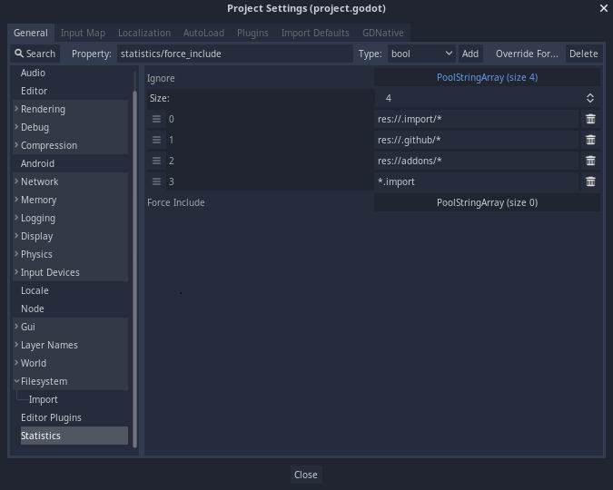
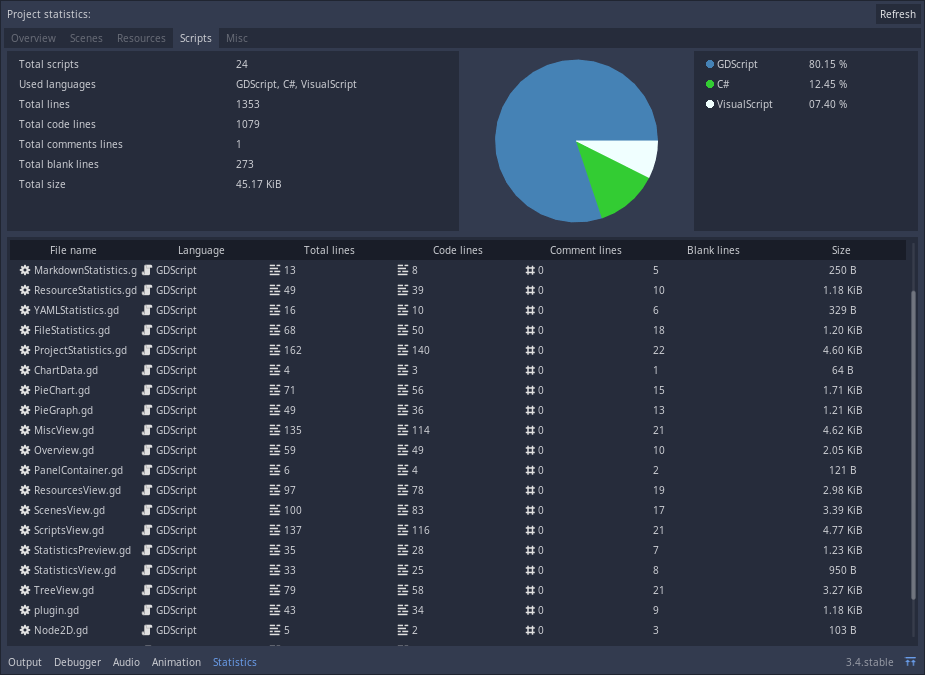
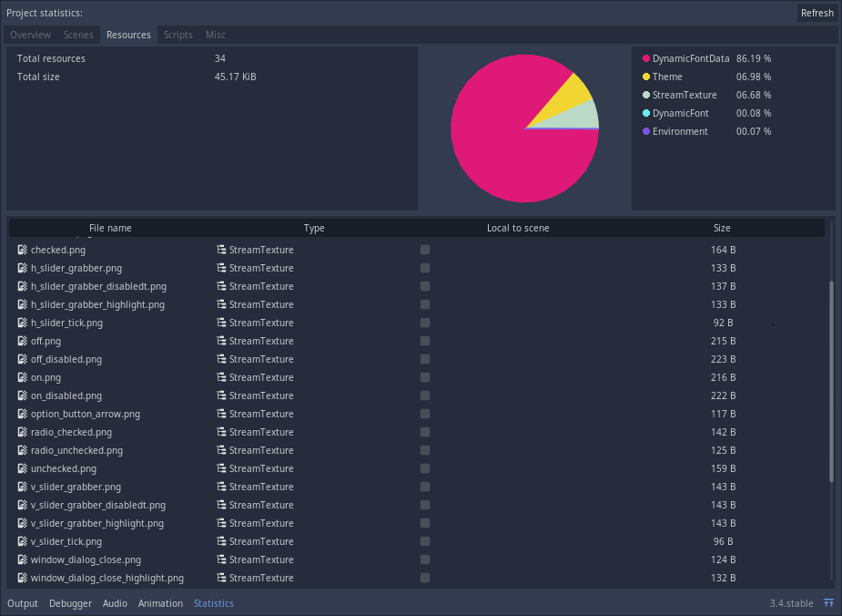
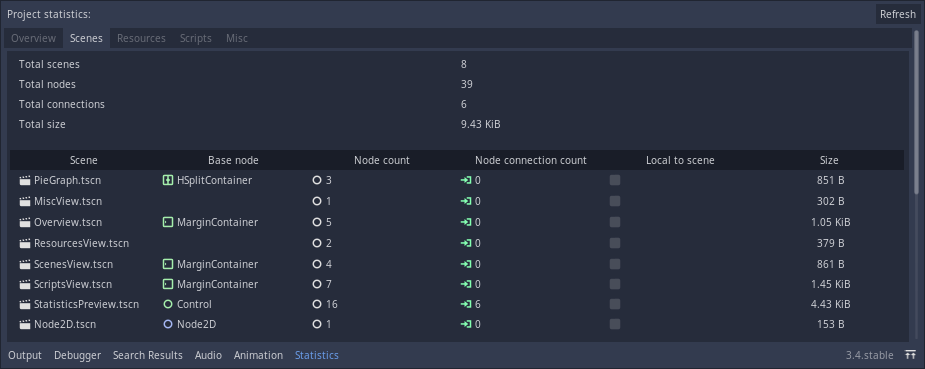
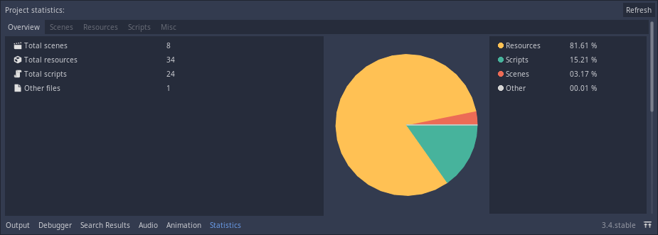

# Godot Project Statistics

An addon for [Godot Engine](https://github.com/godotengine/godot/) which adds an UI panel to display some information on the current opened project ([view screenshots](#screenshots)).

## Features

* Scripts lines count (code, comments, blank and total).
* Scenes count, size and number of nodes on each scene.
* Resources count and size.
* Display most used resources and file types on a pie graph.
* Exclude files or directories from statistics generation.

## Configuration

The configuration can be edited at `Project Settings > Statistics`:

* `Ignore`: A list of string paths to be ignored. (case-insensitive)

* `Force Include`: A list of string paths to be included regardless if a path is found in the `Ignore` list. (case-insensitive)

> Note: matching expressions is possible where "*" matches zero or more arbitrary characters and "?" matches any single character except a period (".")

## Screenshots

